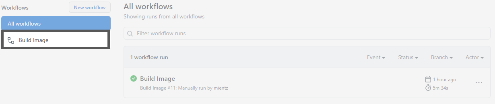
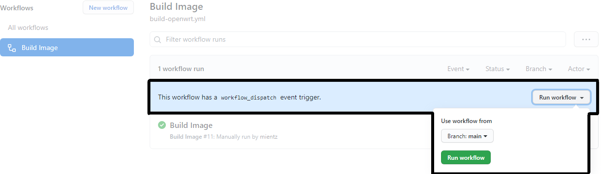

<h2 align="center">
   
  
   
  GitHub Actions Template
   
</h2>
<h4 align="center">A simple <a href="https://github.com/features/actions" target="_blank">GitHub Actions Workflow</a> template to build <a href="https://openwrt.org/docs/guide-user/additional-software/imagebuilder" target="_blank">OpenWrt Image</a>.</h4>

  
  
  
   
  

## Key Features
* Support all OpenWrt release since 17.01.0.
* Support all targets and build profiles.
* Easier to build image for different targets.
  - Just use this repo template to build your OpenWrt image.
* Automatically create release with list of any packages included.
* Manually run the workflow to avoid rate limit.

## How To Use
1. On GitHub, navigate to the main page of this repository.
2. Above the file list, click Use this template.

  

3. Type a name for your repository, and an optional description.
4. Modify the [workflow](.github/workflows/build-openwrt.yml) file according to the target image you want to build.
5. Go to Actions. Under your repository name, click Actions.

  

6. In the left sidebar, click the workflow `Build Image`.

  

7. in the `Build Image` workflows, click the **Run workflow**.

  

8. The log shows you how each of the steps was processed. Expand any of the steps to view its details

  

## Acknowledgments
* [OpenWrt](https://github.com/openwrt/openwrt)
  Project is a Linux operating system targeting embedded devices. Instead
  of trying to create a single, static firmware, OpenWrt provides a fully
  writable filesystem with package management. This frees you from the
  application selection and configuration provided by the vendor and allows you
  to customize the device through the use of packages to suit any application.
  For developers, OpenWrt is the framework to build an application without having
  to build a complete firmware around it; for users this means the ability for
  full customization, to use the device in ways never envisioned.

* [softprops/action-gh-release](https://github.com/softprops/action-gh-release)
  A GitHub Action for creating GitHub Releases on Linux, Windows, and macOS virtual environments